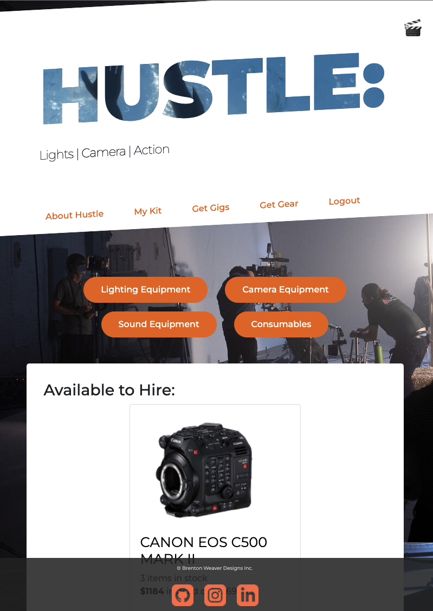

# hustle: Get Filming Faster

    Deployed link: https://hustleupfilm.herokuapp.com/
    Repo link: https://github.com/Brento20/hustle_2point0

## Description
Hustle is a web based platform that allows new and up and coming film industry professionals find and lease equipment, connect with peers and create high quality productions.

Its goal is to remove the financial stress and help to get more people into the Australian Film industry.

The way the application dose this is by making the user pay only insurance and maintenance on the equipment. In future additions the user would be required to subscribe to the service to be able to use it.

 
 

## Installation

    1. Download the repository and open with your preferred client (like VS code).
    2. Open the integrated terminal and from the top folder in the directory, 
        run "NPM INSTALL" to download the required packages.
    3. Seed the database by running "NPM RUN SEED".
    4. Start the application using "NPM RUN START".
    5. Open your browser, by default the page will use your local host 3000.
    6. If you wish to deploy, please use config variables in your platform of choice.

**Note: This project requires Node.js and Mongo to be installed on your computer.**

## Technology

This application is a full stack (MERN) project.

The backend uses:

    🟢 Apollo and Graphql - assists with state management.
    🟢 bcrypt - to help hashing passwords and improving database security.
    🟢 express - adds functionality to node.js to manage requests.
    🟢 jsonwebtoken - NPM package helps to open a secure path between the client and server side of the application once a user is logged in.
    🟢 mongoose - Manages the schema validations when adding code to a mongoDB database.
    🟢 Node.js - Allowing the use of Javascript in a server environment.

The frontend uses:

    🟢 REACT - React is the scaffolding for this application allowing 
    🟢 Material-UI/MUI - I would like to use this on more components moving forward but its a start!
    🟢 Custom CSS - Custom index.css file applied
    🟢 Bootstrap - mostly used for grid layout and managing breakpoints.

Note: A test environment for stripe payment is pre-coded in to this project.

***Deployed About/Homepage:***

***Deployed Get Gear page:***

Image Credits:
 Images used in this project are not my own and are used to demonstrate functionality, not as a final release.